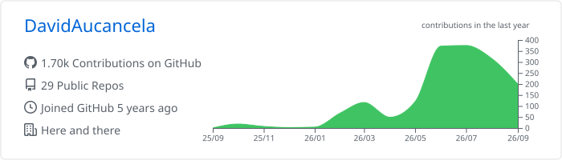
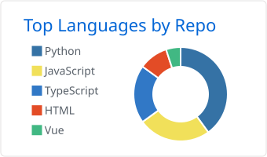
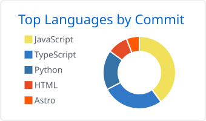
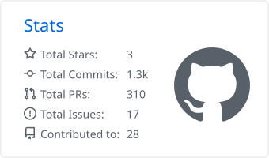
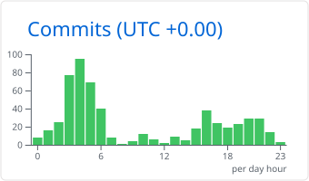

# David Aucancela 🇪🇨

### Software Engineer building AI systems that are secure, observable and cost-aware

 

## About me
 
I'm a software engineer who enjoys building things that hold up in the real world, not just in demos. Most of my work lives where AI meets production: making language models reliable, measurable and safe enough to trust with real users. I split my time between shipping products for clients, looking at systems from the attacker's side, and building games when I want to tell a story instead of solving a ticket. I learn by building, and there's always something on the workbench.

## Projects

| Project | Stack | Description |
|---|---|---|
| **[LLM Observatory](https://github.com/DavidAucancela/LLM-observatory-)** | React · Node.js · PostgreSQL| Dashboard for monitoring and tracking AI API consumption and costs |
| **[CodeReviewX](https://github.com/DavidAucancela/CodeReviewX-)** | Python · GitHub App · Claude API | Automated PR reviews: webhooks → static analysis → LLM review of logic bugs and security issues |
| **[KOS](https://github.com/DavidAucancela/KOS)** | Python · Neo4j · Ollama | Knowledge graph that keeps long-term memory through agents |
| **[whisperX](https://github.com/DavidAucancela/whisperX)** | Python · OpenAI Whisper · Audio | Centralized transcription & translation with validation, caching, logging and cost control |
| **[Portfolio Multimodal](https://github.com/DavidAucancela/Portfolio)** | Next.js · Tailwind · JotAI mascot | Personal site with fourth modes — `.dev` / `.ia` / `.sec` / `.gam` — featuring an animated AI assistant |
| **[Nunna](https://github.com/DavidAucancela/Nunna)** | Next.js 15 · NestJS · PostgreSQL | Digital catalog + immersive experience about Riobamba parades |

## Security journey
 
- **Hack The Box** — member of team **Creeper.exe**
- **CTF competitions** — V-Sandbox CTF
- **Ethical Hacking Essentials (EHE)** — EC-Council 

## Tools

| | |
|---|---|
| **Languages** |      |
| **Frontend** |       |
| **Backend** |      |
| **Databases** |         |
| **DevOps & Cloud** |        |
| **AI & Automation** |          |
| **Security** |     |

## Stats 
 

  <picture>
    <source media="(prefers-color-scheme: dark)" srcset="./profile-summary-card-output/github_dark/0-profile-details.svg"/>
    
  </picture>

  <picture>
    <source media="(prefers-color-scheme: dark)" srcset="./profile-summary-card-output/github_dark/1-repos-per-language.svg"/>
    
  </picture>
  <picture>
    <source media="(prefers-color-scheme: dark)" srcset="./profile-summary-card-output/github_dark/2-most-commit-language.svg"/>
    
  </picture>

  <picture>
    <source media="(prefers-color-scheme: dark)" srcset="./profile-summary-card-output/github_dark/3-stats.svg"/>
    
  </picture>
  <picture>
    <source media="(prefers-color-scheme: dark)" srcset="./profile-summary-card-output/github_dark/4-productive-time.svg"/>
    
  </picture>

 
<picture>
  <source media="(prefers-color-scheme: dark)" srcset="https://raw.githubusercontent.com/DavidAucancela/DavidAucancela/output/github-contribution-grid-snake-dark.svg"/>
  
</picture>

## Let's work together

 
Open to remote AI/backend roles and freelance AI automation projects.

 

 
❝ Do or do not, there is no try. ❞ — Yoda

